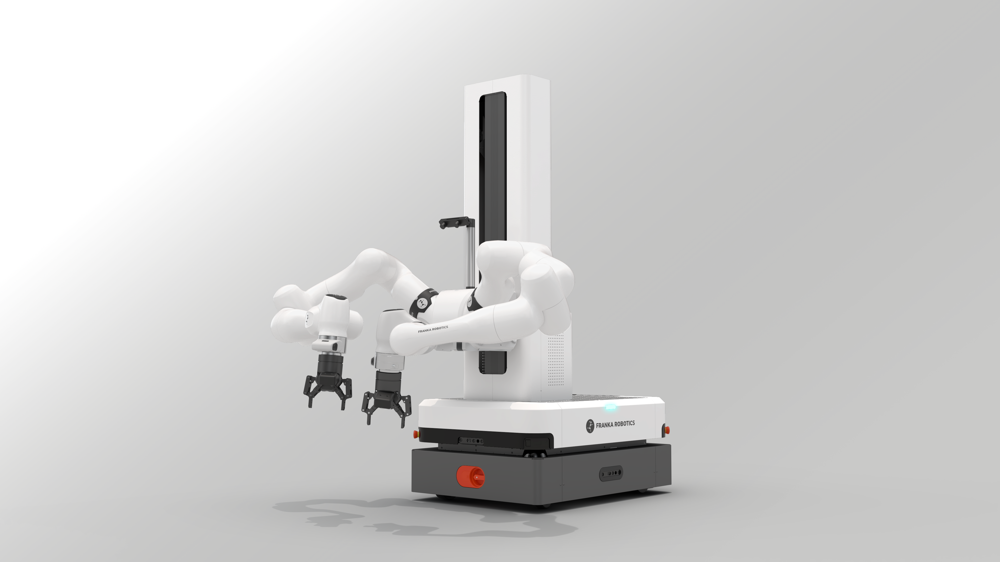

# IROS 2026 Workshop Website — IROS-EBiM

**Toward a Globally Coordinated Benchmark for Real-World Embodied Bimanual Manipulation**

IROS 2026 Half-Day Workshop · September 27 – October 1, 2026 · Pittsburgh, PA, USA

🌐 **Live site:** [iros-ebim.github.io](https://iros-ebim.github.io)
📧 **Contact:** [iros.ebim@gmail.com](mailto:iros.ebim@gmail.com)

---

## Architecture overview

The site is a **multi-page** static site (no build step). Three primary pages plus a 404:

| Page | URL | Purpose |
|---|---|---|
| **Home** | `index.html` | Landing page that funnels visitors to one of two tracks — minimal deep content, maximal navigation clarity |
| **Competition** | `competition.html` | The EBiM Competition — benchmark tasks, Mobile FR3 Duo platform, cross-continent testbeds, CFP |
| **Workshop** | `workshop.html` | The IROS 2026 workshop program — schedule, invited talks, panel, posters, dissemination |
| **404** | `404.html` | Branded not-found page (`noindex`) with shared chrome and CTAs back to the three primary pages |

### Why the split

The home page used to contain everything — schedule, benchmark spec, platform photos, task cards, organizers, sponsors. As the project grew, the page became too long and visitors couldn't quickly find what they needed. The current architecture:

- **Home** acts as a landing/funnel page (Two Ways to Engage cards, Important Dates summary, Key Themes, Organizers, Sponsors).
- **Competition** owns benchmark/platform/task/testbed deep content.
- **Workshop** owns schedule/talks/panel/posters/dissemination deep content.
- The Three-Phase Mechanism diagram appears on Home and Competition (Phase III = the Workshop is referenced as a link).
- Organizers and Sponsors live only on Home and are linked from sub-pages.

---

## Project structure

```
iros-ebim.github.io/
├── index.html                           # Landing page (funnel to sub-pages)
├── competition.html                     # The EBiM Competition
├── workshop.html                        # IROS 2026 Workshop Program
├── 404.html                             # Branded 404 (noindex)
├── css/
│   └── style.css                        # All shared styles, including dropdowns,
│                                        #   TOC sidebar, mobile drawer, dropdown toggles
├── js/
│   └── main.js                          # Navbar scroll FX, mobile hamburger,
│                                        #   collapsible mobile dropdowns, scroll-active
│                                        #   nav + TOC tracking, fade-in observer
├── img/
│   ├── favicon.svg                      # Site favicon
│   ├── IROS_2026_logo.webp              # IROS 2026 Pittsburgh logo (hero + footer)
│   ├── og-cover.jpg                     # Open Graph card (1200×630, ~116 KB)
│   ├── platform/
│   │   ├── MFR3_Duo.webp                # 1600×900 WebP (~18 KB) — primary
│   │   ├── MFR3_Duo.png                 # 4000×2250 PNG (~4 MB)  — fallback
│   │   ├── MFR3_Duo_with_workbench.webp # 1600×900 WebP (~31 KB) — primary
│   │   └── MFR3_Duo_with_workbench.png  # 4000×2250 PNG (~6.7 MB) — fallback
│   ├── organizers/                      # Organizer headshots — to be added
│   ├── sponsors/                        # Sponsor logos
│   │   ├── agile_robots.svg             # Agile Robots (white; brightness(0) filter)
│   │   ├── agile_robots_dark.jpg        # Agile Robots dark variant
│   │   ├── franka_robotics.svg          # Franka Robotics
│   │   ├── franka_robotics_white.png
│   │   ├── tca.png                      # Taipei Computer Association
│   │   ├── mech_mind.png                # Mech-Mind (dark)
│   │   ├── mech_mind_white.png
│   │   ├── robotgym.webp                # RobotGym (dark)
│   │   ├── robotgym_white.webp
│   │   ├── amd.svg                      # AMD (white; brightness(0) filter)
│   │   └── google.svg                   # Google (Computing Resources tier)
│   ├── speakers/                        # (reserved — not used yet)
│   └── tasks/                           # (reserved — not used yet)
├── robots.txt                           # Allow-all + sitemap pointer
├── sitemap.xml                          # 3 URLs (home, competition, workshop)
├── .nojekyll                            # Disable Jekyll on GitHub Pages
└── README.md
```

---

## Setup

Plain HTML/CSS/JS — no build step, no dependencies.

### Local preview

```bash
python -m http.server 8000
# then open http://localhost:8000
```

### GitHub Pages deployment

Push to `main` of `IROS-EBiM/iros-ebim.github.io`; GitHub Pages auto-deploys at `https://iros-ebim.github.io`.

---

## Page sections

### Home (`index.html`)

| Section | ID | Purpose |
|---|---|---|
| Hero | `#home` | Full-viewport hero with two CTAs (Enter Competition / View Workshop) |
| Workshop Overview | `#overview` | Abstract paragraph + Three-Phase Pipeline diagram |
| Two Ways to Engage | `#engage` | Paired feature cards funneling to Competition / Workshop |
| Key Themes | `#themes` | 4 research-question cards (sim-to-real, cross-site repro, foundation/VLA, contact-rich) |
| Important Dates | `#dates` | 2-column track summary (Competition vs Workshop dates) |
| Organizers | `#organizers` | Organizing Committee, Advisory Board, Competition Support Team |
| Sponsors | `#sponsors` | Hardware & Platform · Computing Resources · Community |
| Get Involved | `#contact` | Dual CTA + email contact (dark section) |

### Competition (`competition.html`)

| Section | ID | Purpose |
|---|---|---|
| Sub-hero | `#home` | 40vh hero with breadcrumb + Register Interest CTA |
| Why This Benchmark | `#why` | Motivation copy |
| Three-Phase Mechanism | `#overview` | Pipeline diagram with link to Workshop page for Phase III |
| Mobile FR3 Duo | `#platform` | Platform specs grid + 2 photos (WebP + PNG fallback) |
| The Benchmark | `#benchmark` | 6-pillar framework |
| Benchmark Tasks | `#tasks` | 3 task cards (cable routing, deformable, caregiving) |
| Cross-Continent Testbeds | `#testbeds` | 4 site cards (Beijing, Hamburg, Munich, Pittsburgh) |
| Call for Participation | `#call-for-participation` | Phase I / Phase II / Eligibility cards + key dates |
| Sponsors | `#sponsors` | Same tier structure as Home |
| Workshop callout | (banner) | "Looking for the Workshop?" → workshop.html |

### Workshop (`workshop.html`)

| Section | ID | Purpose |
|---|---|---|
| Sub-hero | `#home` | 40vh hero with breadcrumb + View Schedule CTA |
| Workshop Overview | `#overview` | Half-day workshop intro with link to Competition page |
| Schedule | `#schedule` | Tentative timeline (08:30–13:30) with type-coded rows |
| Invited Talks | `#talks` | 5 speaker cards with avatars + talk titles |
| Panel Discussion | `#panel` | Host + panelists + 3 discussion themes |
| Poster Session & CFP | `#call-for-participation` | Extended Abstracts / Live Demos / Participation cards |
| Important Dates | `#contact` | Poster deadline / Notification / Camera-Ready / Workshop Day (dark section) |
| Dissemination | `#dissemination` | 4 cards (long-term site, slides, open protocols, perspective article) |
| Competition callout | (banner) | "Looking for the Competition?" → competition.html |

---

## Workshop program (final)

**Format:** Half-day morning session — exact date within September 27 – October 1, 2026

| Time | Session |
|------|---------|
| 08:30–08:40 | Opening Remarks |
| 08:40–09:00 | Invited Talk 1 — Prof. Abhinav Valada (Freiburg) |
| 09:00–09:20 | Invited Talk 2 — Prof. Roberto Martín-Martín (UT Austin) |
| 09:20–09:40 | Competition Highlights — Winner Teams (1st, 2nd, 3rd place) |
| 09:40–10:25 | Poster Session & Coffee Break |
| 10:25–10:45 | Invited Talk 3 — Prof. Georgia Chalvatzaki (TU Darmstadt) |
| 10:45–11:05 | Invited Talk 4 — Prof. Chuchu Fan (MIT) |
| 11:05–11:25 | Invited Talk 5 — Prof. He Wang (Peking University) |
| 11:25–11:55 | Panel Discussion — Host: Dr. Wenkai Chen |
| 11:55–12:30 | Best Poster Award & Competition Award |
| 12:30–13:30 | Sponsored Lunch & Networking |

---

## Benchmark tasks (3 core tasks)

1. **Cable Routing & Plugging** — contact-rich, sequential
2. **Deformable Material Handling (Thermal Pad Placement)** — deformable, precision
3. **Caregiving & Feeding** — human-centered, safety-critical

## Competition platform

**Mobile FR3 Duo by Franka Robotics** — deployed at all four testbed sites:
Beijing · Hamburg · Munich · Pittsburgh

---

## Shared chrome (navbar + footer)

The navbar and footer are **byte-identical** across all 4 pages. Each is wrapped in a comment marker:

```html
<!-- SHARED NAVBAR — keep in sync across index.html, competition.html, workshop.html, 404.html -->
<nav id="navbar" ...>...</nav>

<!-- SHARED FOOTER — keep in sync across index.html, competition.html, workshop.html, 404.html -->
<footer id="footer">...</footer>
```

### Updating the shared chrome

When changing the navbar or footer:

1. Update the block in **one** file.
2. Copy/paste the same block into the other 3 files.
3. Verify byte-equality:

```bash
# Quick sanity check (run from repo root)
python -c "
import re, hashlib
from pathlib import Path
for which, pat in [('NAVBAR', r'<!-- SHARED NAVBAR.*?</nav>'),
                   ('FOOTER', r'<!-- SHARED FOOTER.*?</footer>')]:
    hashes = set()
    for p in ['index.html', 'competition.html', 'workshop.html', '404.html']:
        m = re.search(pat, Path(p).read_text(encoding='utf-8'), re.S)
        hashes.add(hashlib.sha256(m.group(0).encode()).hexdigest()[:12])
    print(f'{which}: {\"OK\" if len(hashes) == 1 else \"DRIFT\"} ({hashes})')
"
```

### Navbar items

- **EBiM·IROS26** brand → `index.html`
- **Home** dropdown → 4 sub-items linking to home sections
- **Competition** dropdown → 7 sub-items linking to competition sections
- **Workshop** dropdown → 7 sub-items linking to workshop sections
- **Organizers** → `index.html#organizers`
- **Sponsors** → `index.html#sponsors`
- **Contact** → `mailto:iros.ebim@gmail.com`

### Footer columns

- **Pages**: Home / Competition / Workshop
- **People**: Organizers / Sponsors
- **Participate**: Compete / Submit Poster / Contact Us

---

## Active page indicator

Each page has a body class that drives the navbar's "you are here" highlight:

| Page | Body class |
|---|---|
| `index.html` | `<body class="page-home">` |
| `competition.html` | `<body class="page-competition">` |
| `workshop.html` | `<body class="page-workshop">` |
| `404.html` | `<body class="page-404">` |

The CSS rule:

```css
.page-home          .nav-home > a,
.page-competition   .nav-competition > a,
.page-workshop      .nav-workshop > a {
  color: var(--accent);
  font-weight: 700;
}
```

For section-level highlighting (which dropdown sub-item or TOC item is currently in view), `js/main.js` adds an `.active` class on scroll, matching any link whose `href` ends with `#<section-id>`. This works for both bare anchors (`#why`) and cross-page hrefs (`competition.html#why`) used in the shared dropdowns.

---

## On-page TOC sidebar (sub-pages only)

`competition.html` and `workshop.html` include an `<aside class="toc-sidebar">` right after their sub-hero. CSS makes it fixed-position, right-side, 200px wide, and visible **only at viewports ≥ 1400px**. The home page and 404 page don't include the aside.

Behavior:
- Hidden by default (CSS `opacity: 0; visibility: hidden`).
- JS adds `.is-visible` once the user scrolls past the sub-hero (with a 100px buffer for a smoother handoff). Fade-in animates over 300ms.
- Default visible state is **55% opacity** so it doesn't compete with content; goes opaque on hover or keyboard focus-within.
- Active section gets a 2px cyan left rail + bold cyan text, driven by the same `markActive()` scroll handler that highlights navbar dropdown items.

---

## Mobile nav behavior

- **Breakpoint**: ≤ 768px shows hamburger; ≥ 769px shows the desktop horizontal navbar.
- **Drawer**: `position: fixed`, slides down from the top with `transform: translateY(calc(-100% - var(--nav-h) - 0.5rem))` in the closed state — this calc-based hide guarantees the drawer fully clears the navbar at any drawer height (a percentage-only translate broke when dropdowns collapsed and the drawer became shorter).
- **Scrollable**: `max-height: calc(100vh - var(--nav-h))` + `overflow-y: auto` so the drawer scrolls when content (especially with all dropdowns expanded) exceeds the viewport.
- **Collapsible dropdowns**: each parent dropdown `<li>` includes a separate `<button class="dropdown-toggle">` next to the link. The link still navigates when tapped; the button toggles a `.expanded` class on the `<li>` to show/hide the sub-menu. One open at a time. Closing the hamburger drawer collapses any expanded dropdown.

---

## SEO infrastructure

Each content page (`index`, `competition`, `workshop`) carries:

| Element | Purpose |
|---|---|
| Unique `<title>` (≤ 66 chars) | SERP truncation safe |
| Unique `<meta name="description">` (≤ 156 chars) | SERP truncation safe |
| Unique `<link rel="canonical">` | Avoid duplicate-content penalties |
| Unique OG (`og:url`, `og:title`, `og:description`) + Twitter Card tags | Per-page social previews |
| OG image (`og-cover.jpg`, 1200×630, ~116 KB) | Spec-compliant social card |
| `<meta name="keywords">` | Used by some academic indexers |
| `<meta name="google-site-verification">` | Search Console verification token |
| JSON-LD `Event` schema | Rich event card |
| JSON-LD `Organization` schema | Brand entity |
| JSON-LD `BreadcrumbList` (sub-pages) | Breadcrumb-style SERP enhancement |
| JSON-LD with `subEvent` array (workshop) | Each invited talk + the panel as discoverable sub-events |

`404.html` is intentionally `noindex` and has no OG tags.

`sitemap.xml` lists 3 URLs (home, competition, workshop) and is referenced from `robots.txt`.

### Heading hierarchy

Each page has exactly **one `<h1>`**. Section headings are `<h2 class="section-title">`. Sub-section headings are `<h3>` (the previous `<h2>` → `<h4>` skips in theme/talk/dissemination cards have been fixed by promoting them to `<h3>`).

### Image attributes

Every `` has `alt`, `width`, `height` (CLS prevention), `loading="lazy"`, and `decoding="async"`. LCP candidates (the IROS logo in each page's hero/sub-hero) carry `fetchpriority="high"` and `loading="eager"`.

---

## Image asset strategy

### Open Graph image
- `img/og-cover.jpg` — 1200×630 JPEG, ~116 KB. Matches the social-share spec. Old `og-cover.png` (1671×936) was removed.

### Platform photos (competition.html only)
- WebP versions are the primary asset for ~96% of browsers (~18 KB and ~31 KB respectively).
- PNG versions stay as fallback for the ~4% of browsers without WebP support, served via `<picture>` element:

  ```html
  <picture>
    <source srcset="img/platform/MFR3_Duo.webp" type="image/webp">
    
  </picture>
  ```
- Net page-weight savings: ~10.7 MB → ~49 KB combined for the two photos when WebP is served.

### Sponsor logos
- SVGs render at native resolution; for raster logos `width`/`height` attrs match the source-file dimensions for CLS prevention.
- All sponsor logos use `loading="lazy"` and `decoding="async"`.

---

## Content status

### Done
- [x] Multi-page restructure: `index.html` (landing), `competition.html`, `workshop.html`, `404.html`
- [x] Shared navbar + footer (byte-identical, comment-tagged)
- [x] Schedule: final 5-talk + competition + panel program (08:30–13:30)
- [x] Benchmark tasks: 3 core tasks
- [x] Organizers: OC (12), Advisory (4), Support (6)
- [x] He Wang talk title: "Learning Diverse Whole-Body Manipulation Skills for Humanoid Robots"
- [x] Chuchu Fan talk title: "Formal Visual Planning with Foundation Models"
- [x] Chalvatzaki affiliation: TU Darmstadt / IEEE RAS TC on Mobile Manipulation
- [x] Mobile FR3 Duo platform section + photos
- [x] IROS 2026 logo in hero/sub-hero and footer on all pages
- [x] Sponsors: Hardware/Platform (Agile, Franka), Computing Resources (Google), Community (TCA, Mech-Mind, RobotGym, AMD)
- [x] Hamburg + 4-testbed coverage
- [x] Branding unified under IROS-EBiM
- [x] OG cover image at 1200×630 spec
- [x] Stefan Schaal (Intrinsic) and Shaowei Cui confirmed as panelists
- [x] Google Search Console verified for `https://iros-ebim.github.io/`
- [x] SEO: per-page meta tags, JSON-LD (Event + Organization + BreadcrumbList), sitemap with 3 URLs, alt text + width/height on every img
- [x] Heading hierarchy fixed (no h2 → h4 skips)
- [x] Mobile nav: scrollable drawer + collapsible dropdowns
- [x] Sticky on-page TOC sidebar on sub-pages (≥1400px)
- [x] Image optimization: platform PNGs → WebP (~99.5% reduction); OG cover resized + reformatted

### Still needed
- [ ] Real headshots in `img/organizers/` (currently using initials avatars)
- [ ] Confirm exact workshop date within September 27 – October 1
- [ ] Fill in submission deadlines on competition.html and workshop.html (currently TBD)
- [ ] Optional: convert remaining sponsor PNGs to WebP for marginal extra perf

---

## Image guidelines

| Folder | Format | Recommended size |
|---|---|---|
| `organizers/` | JPG or PNG | 300 × 300 px |
| `sponsors/` | SVG preferred (or PNG with transparent bg) | ~400 × 160 px |
| `platform/` | WebP primary + PNG fallback | 1600 × 900 px (WebP), keep originals as PNG |
| OG cover | JPG | 1200 × 630 px |

---

## License

Website code MIT licensed. Workshop content © 2026 the respective authors.
